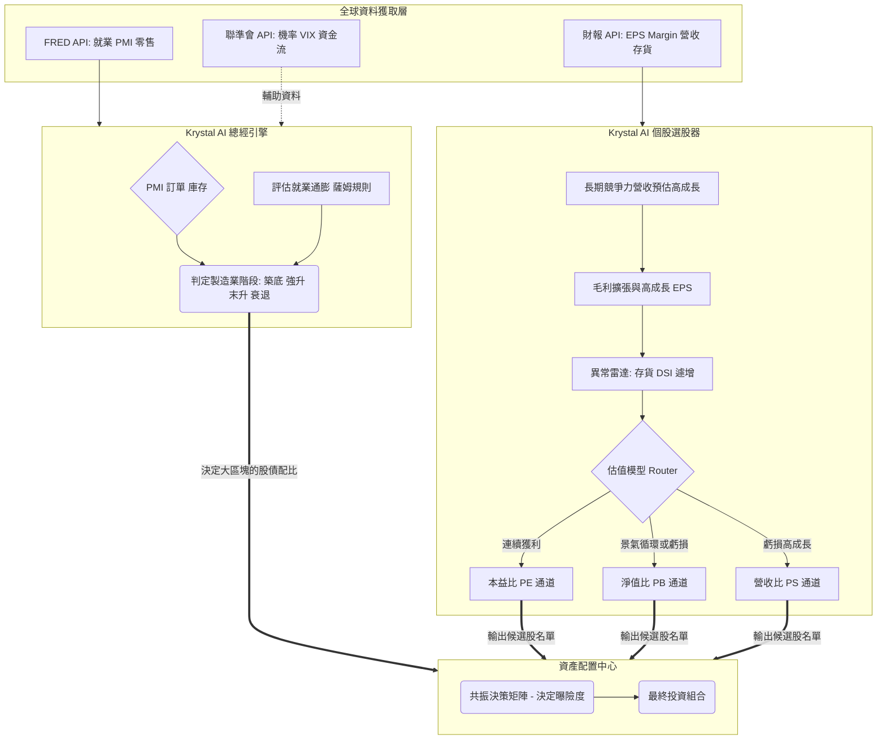

# Krystal AI 交易系統：總經與個股策略整合架構設計與 3 大實作方案

這份文件展示如何將「總經製造業循環 (Macro)」與「基本面個股估值模型 (Micro)」無縫融合，構建為 **Krystal AI 交易系統**的核心投資策略大腦，使您的系統能做到**「在對的市場週期，把資金重押在通過嚴格財報檢驗的好公司」**。

---

## 1. Krystal AI 系統總體架構圖 (Macro + Micro Integration)

請參考以下 Mermaid 系統架構圖理解這兩個模組的上下游關係：
[ 外部資料匯入端 ]
 ├─ FRED API (提供：就業、PMI、零售銷售)
 ├─ 財報 API (提供：個股 EPS、毛利率、存貨天數)
 └─ 聯準會 API (提供：資金流、降息機率)
      │
      ▼
[ Krystal AI 總經引擎 (Macro) ] ── (決定當下是：築底/強升/末升/衰退)
 ├─ 評估1：PMI 訂單 vs 庫存
 └─ 評估2：薩姆規則衰退指標
      │
      ▼ (總經燈號往下傳遞，決定下一層的資金要放多少%去買股)
      │
[ Krystal AI 個股選股池 (Micro) ]
 ├─ 關卡1：所屬產業營收 CAGR 必須 > 10%
 ├─ 關卡2：毛利率必須擴張，EPS 高成長
 ├─ 關卡3：(防護網) 存貨 DSI 不得異常遽增
 │    │
 │    ▼
 │  (系統路由器自動切換 3 大估值通道)
 ├─ 通道A：連續獲利股 ──────▶ 走 [本益比 PE 估值通道]
 ├─ 通道B：景氣循環或虧損股 ──▶ 走 [淨值比 PB 估值通道]
 └─ 通道C：虧損但超高成長股 ──▶ 走 [營收比 PS 估值通道]
      │
      ▼
[ 資產配置與執行中心 ]
 └─ Krystal AI 共振決策矩陣 (統整總經勝率 + 個股估值)
      │
      ▼
 🏆 最終投資組合產出 (Portfolio)

> **架構說明**：
> 總經引擎扮演 **「風控官」** 的角色，決定市場目前所處的季節（牛熊或循環狀態）；個股引擎則扮演 **「獵人」** 的角色，在合理的估值通道內挑選標的。兩者交會於配置引擎決定「買什麼、買多少」。

---

## 2. Krystal AI 整合實作：三個發展方案 (3 Alternative Schemes)

從系統開發與策略運行的角度，我為您規劃了三種將上述模組合而為一的實踐方案，您可以根據當前的技術積累程度來選擇適合的路徑。

### 方案 A：規則觸發硬核過濾法 (Rule-Based Matrix) —— 「穩紮穩打型」
*   **概念**：全依靠嚴格的硬規則 `IF-THEN-ELSE`。總經訊號決定「水位與資金門檻」，個股訊號決定「具體標的」。
*   **實作邏輯**：
    1.  **宏觀總閘門**：如果目前的製造業燈號（MacroState）處於 **「衰退段 (主動去庫存)」**，則系統**完全鎖死股票部位的加倉權限**，強制將資金注入 70% 的美國公債 (TLT/IEF) 與 30% 現金，無論個股估值多便宜。
    2.  **微觀篩選閥**：當燈號轉入 **「築底段 或 強升段」** 時，系統解鎖股票倉位上限（例如放寬至 80-100% 滿倉），同步啟動 `krystal_screener_growth_leaders`。
    3.  **估值彈性**：處於「強升段」時，系統允許個股在 PE/PB 河流圖的「+1 標準差」建倉；若處於「末升段」，則必須嚴苛挑選在「-1 標準差（超跌低估區）」才獲准建倉。
*   **優點**：邏輯 100% 透明可控，程式碼容易撰寫與 Debug，歷史回測的因果關係極度清晰。
*   **缺點**：條件過於剛硬，可能在訊號反轉的初期錯失一波行情。

### 方案 B：動態雙軌評分法 (Dynamic Weighted Scoring) —— 「進階量化型」
*   **概念**：捨棄絕對的 On/Off 開關，改採 0～100 分的評分系統。這也是多數量化基金（Quant Funds）愛用的多因子模型 (Multi-factor model) 變形。
*   **實作邏輯**：
    1.  **總經分數 (Macro Score, 0-100)**：基於新訂單/庫存剪刀差、降息機率、薩姆規則給予綜合性平滑分數。
    2.  **個股分數 (Micro Score, 0-100)**：結合估值通道距離 (與合理價差距多遠)、毛利率季增率、籌碼面，給出個股強度分數。
    3.  **總合與權重 (Total Allocation Score)**：
        `最終持有權重 = (Macro Score × 60%) + (Micro Score × 40%)`
    4.  舉例：如果台積電個股分數極高 (90分)，但當下處於衰退段宏觀極差 (20分)。最終得分為 48 分，系統依然會持有台積電，但會把該單筆權重嚴格壓縮在極低比例（例如 2%），不會清空。
*   **優點**：部位轉換過渡平滑，不會有「某一天因指標跨過臨界值而大舉閃電換倉」的巨大交易摩擦成本。能在景氣低迷時勇敢佈局微小極優股。
*   **缺點**：參數調校 (Tuning) 需要耗費時間，決定各種分數的比例權重需要海量的歷史回測支持。

### 方案 C：機器學習因子預測法 (ML Enhanced Hybrid) —— 「AI 智能型」
*   **概念**：讓機器自己學會「總經指標在特定循環中，對哪些基本面因子的影響力最大」，而不由人類寫死。
*   **實作邏輯**：
    1.  **特徵工程 (Feature Engineering)**：
        *   將總經數據（PMI差值、CPI年增、失業率增減）做為宏觀特徵 (Macro Features)。
        *   將個股財報數據（毛利、庫存天數、PE/PB 位階）做為微觀特徵 (Micro Features)。
    2.  **模型訓練 (Model Training)**：餵入如 `XGBoost`, `LightGBM` 或時序網路 `LSTM`，預測目標 (Target) 為該股票未來一季的超額報酬率 (Alpha)。
    3.  **智慧挑選**：Krystal AI 系統不會看到寫死的「衰退期買債券」，而是模型自動在數據中發現「當薩姆規則陡增時，高本益比科技股的勝率期望值為負，低波動防禦股的預期收益為正」，並自動產出最佳投資組合。
*   **優點**：這才是真正的 "Krystal **AI** System"。系統具備發現人類未曾察覺的非線性關係的能力。
*   **缺點**：開發門檻極高。需要面對資料過適 (Overfitting)、金融資料低雜訊比 (Low Signal-to-Noise ratio) 的問題，屬於黑盒子操作，遇到大幅虧損時較難以除錯。

---

## 建議行動方針 (Next Steps)
對於個人交易系統的建構，**推薦優先實作【方案 A (規則觸發硬核過濾法)】** 做為 Krystal AI 的 V1.0 核心。

1. **先保底：** 將方案 A 的規則寫成 Python 類別，確保在遇到黑天鵝與大熊市時，Krystal AI 能藉由強制總經訊號自動退出股票市場持取現金/美債。
2. **再進化：** 運行超過一季後，開始逐漸將模組平移改造為 【方案 B (動態雙軌評分)】，以追求更精細的報酬體現。
